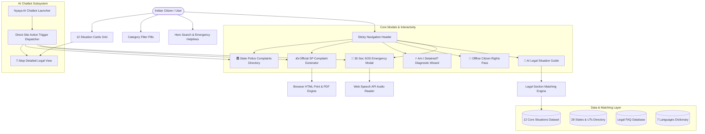
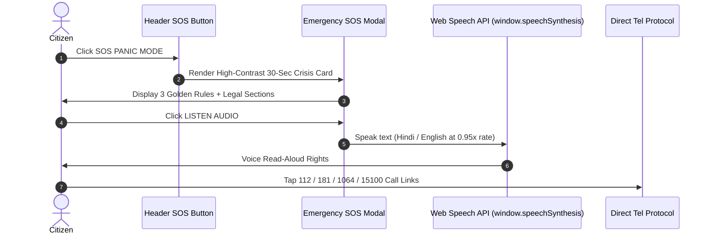
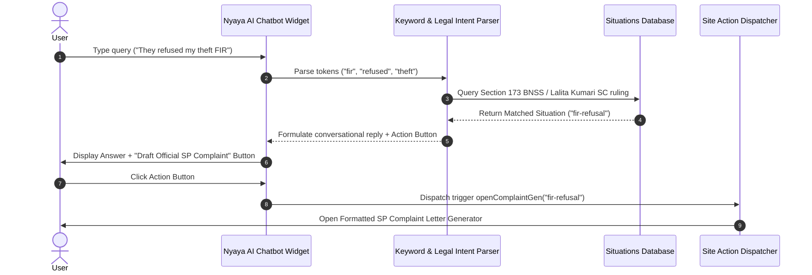

# System Architecture & Flow Specifications

## 1. Executive Summary
**Know Your Police Rights** is a zero-latency, client-side progressive web application built to deliver authoritative, legal action guidance for Indian citizens during police interactions within **30 seconds**.

The architecture is designed for:
1. **High Availability & Zero Server Latency**: Operates completely client-side to ensure full functionality even under poor network connectivity.
2. **Dual Legal Alignment**: Simultaneously indexes **Bharatiya Nagarik Suraksha Sanhita (BNSS 2023)** and **Code of Criminal Procedure (CrPC 1973)** alongside landmark **Supreme Court of India** precedents (*D.K. Basu*, *Lalita Kumari*, *Arnesh Kumar*, *Paramvir Singh Saini*).
3. **Multilingual Access & Audio Accessibility**: Implements native Web Speech API (`window.speechSynthesis`) and a 7-language translation matrix.
4. **Interactive Action Engine**: Enables interactive complaint generation under Sec 173(4) BNSS and rapid diagnostic wizard decision trees.

---

## 2. High-Level System Architecture



---

## 3. Data Flow Architecture

### 3.1 30-Second Crisis SOS Flow


### 3.2 Nyaya AI & Legal Section Matching Flow


---

## 4. Core Component Hierarchy & Responsibilities

| Component | Path | Core Responsibility |
| :--- | :--- | :--- |
| **App** | `src/App.tsx` | Master state manager (language, search filter, active modals, theme styling). |
| **Header** | `src/components/Header.tsx` | Sticky navbar with logo, emergency SOS trigger, language dropdown, and modal launcher tools. |
| **SituationCard** | `src/components/SituationCard.tsx` | Glassmorphism card displaying scenario summary, category icon, golden rule pill, and legal section badge. |
| **SituationDetailModal** | `src/components/SituationDetailModal.tsx` | Renders the complete **7-step legal breakdown** (*What is Happening, Your Rights, What To Do, What To Avoid, Where To Complain, Evidence, Next Step*). |
| **EmergencySOSModal** | `src/components/EmergencySOSModal.tsx` | High-contrast emergency screen with 3 Golden Rules, TTS speech playback, and tap-to-call helpline dialers. |
| **ComplaintGeneratorModal** | `src/components/ComplaintGeneratorModal.tsx` | Interactive form generating formal legal complaints under **Sec 173(4) BNSS / 154(3) CrPC** with live document preview and print/PDF support. |
| **StateDirectoryModal** | `src/components/StateDirectoryModal.tsx` | Filterable directory of Police Complaints Authorities (PCA), Anti-Corruption Bureaus (ACB), and SHRCs for 28 States & UTs. |
| **AIChatBotWidget** | `src/components/AIChatBotWidget.tsx` | Floating interactive conversational AI assistant with in-chat website action dispatchers and voice playback. |
| **AILegalAssistantModal** | `src/components/AILegalAssistantModal.tsx` | Natural language scenario query analyzer mapping plain text to BNSS/CrPC laws. |
| **RightsCardModal** | `src/components/RightsCardModal.tsx` | Printable & downloadable pocket-sized emergency wallet pass for offline access. |
| **DecisionWizardModal** | `src/components/DecisionWizardModal.tsx` | 3-step rapid diagnostic questionnaire wizard (*"Am I Being Detained?"*). |
| **FAQSection** | `src/components/FAQSection.tsx` | Accordion answering common legal myths with section citations. |
| **Footer** | `src/components/Footer.tsx` | Official government citations (IndiaCode, NALSA, SC, NHRC), legal disclaimer, and GitHub author profile. |

---

## 5. Legal Database & Schema Specifications

### 5.1 Situation Data Schema (`src/data/situations.ts`)

```typescript
export interface LegalSection {
  newLaw: string;        // BNSS 2023 / BNS 2023 / BSA 2023
  oldLaw: string;        // CrPC 1973 / IPC 1860 / Evidence Act 1872
  description: string;   // Statutory right description
  landmarkCase?: string; // Landmark Supreme Court Ruling
  sourceUrl?: string;    // Official indiacode.nic.in reference link
}

export interface Situation {
  id: string;
  title: string;
  category: 'street' | 'arrest' | 'fir' | 'search' | 'misconduct' | 'women' | 'property';
  icon: string;
  shortSummary: string;       // 1-sentence 5-second overview
  emergencyBullets: string[]; // Top 3 rules for 30-second crisis mode
  rights: LegalSection[];
  whatToDo: string[];        // Immediate action steps
  whatToAvoid: string[];     // Things that escalate risk or self-incriminate
  whereToComplain: {
    authority: string;
    action: string;
    contact?: string;
  }[];
  evidenceToKeep: string[];  // Memos, badge numbers, MLC reports
  nextSteps: string;         // Legal recourse / court remedies
}
```

### 5.2 State Directory Schema (`src/data/statesDirectory.ts`)

```typescript
export interface StateAuthority {
  state: string;
  pca: {
    name: string;
    phone: string;
    email: string;
    website: string;
    address: string;
  };
  acb: {
    name: string;
    phone: string;
    website: string;
  };
  shrc: {
    name: string;
    phone: string;
    website: string;
  };
  dlsaPhone: string;
}
```

---

## 6. Security, Privacy & Compliance Posture

1. **Zero Data Retention**: The application does not collect, track, or store personal user input, location data, or complaint details on any remote server. All complaint drafting occurs strictly in browser memory.
2. **Client-Side Privacy**: Citizens can generate SP representations or browse rights without leaving digital traces or requiring user login.
3. **No Third-Party Trackers**: Operates without invasive tracking analytics to protect citizens seeking legal aid.
4. **Authoritative Legal Verification**: Cites primary government legal sources (India Code, indiacode.nic.in, Supreme Court of India judgments, NALSA).

---

## 7. Build & Deployment Architecture

- **Bundler**: Vite 5 configured for ES2020 target and TypeScript strict checking.
- **Vercel SPA Rewrite Rules**: `vercel.json` maps all route traffic to `/index.html` to prevent 404 errors during direct link navigation.
- **Git Version Control**: Clean git history tracking features, datasets, and components.
